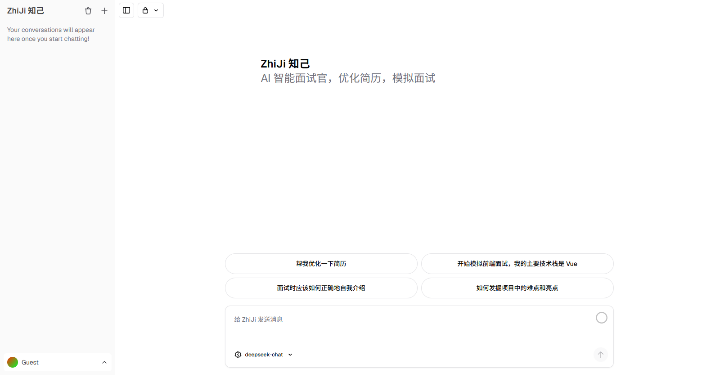

# ZhiJi 🤖✨

[](https://github.com/Leonardo-tao/ZhiJi)
[](https://zhiji.codercat.top)

*Read this in other languages: [简体中文](README_zh.md), English.*

ZhiJi is a powerful, open-source AI Chatbot built with the Next.js App Router and the Vercel AI SDK. It provides an advanced, unified interface for multiple AI models and features robust artifact generation, making it more than just a chat application—it's your intelligent assistant for mock interviews and resume optimization!

## 🔗 Links
- **Live Demo**: [zhiji.codercat.top](https://zhiji.codercat.top)
- **GitHub Repository**: [Leonardo-tao/ZhiJi](https://github.com/Leonardo-tao/ZhiJi)

## 🌟 Key Features

- 💬 **Multi-Modal AI Chat**: Support for rich text, image understanding, and file uploads.
- 🎨 **Artifacts Generation**: Dynamically generate, preview, and edit code, text documents, spreadsheets, and images directly within the chat interface.
- 🤖 **Intelligent Agents**: Specialized built-in agents including Mock Interviewers and Resume Optimizers.
- 🌐 **Seamless LLM Integrations**: Powered by Vercel AI SDK with support for DeepSeek, xAI, OpenAI, and more.
- 🔒 **Robust Authentication**: Secure user login and registration powered by Auth.js (NextAuth v5), plus a convenient Guest mode.
- 💾 **Data Persistence**: Chat history, user data, and documents are securely stored using Neon Postgres and Drizzle ORM.
- 💅 **Beautiful UI/UX**: Crafted with Tailwind CSS, shadcn/ui, and Framer Motion for smooth animations and a fully responsive design.
- ⚡ **Real-time Streaming**: Enjoy real-time, low-latency AI responses with React Server Components (RSCs) and Server-Sent Events.

## 📸 Screenshot



## 🛠️ Tech Stack

- **Framework**: [Next.js](https://nextjs.org/) (App Router, Server Actions)
- **AI Integration**: [Vercel AI SDK](https://sdk.vercel.ai/docs)
- **Database**: [PostgreSQL](https://postgresql.org/) (Neon) & [Drizzle ORM](https://orm.drizzle.team/)
- **Authentication**: [Auth.js](https://authjs.dev/)
- **Styling**: [Tailwind CSS](https://tailwindcss.com/) & [shadcn/ui](https://ui.shadcn.com/)
- **Storage**: [Vercel Blob](https://vercel.com/docs/storage/vercel-blob)
- **Editors**: CodeMirror & ProseMirror

## 🚀 Getting Started

### Prerequisites
- Node.js (v18+)
- pnpm
- A PostgreSQL database (e.g., Neon)

### Running locally

1. **Clone the repository**
   ```bash
   git clone https://github.com/Leonardo-tao/ZhiJi.git
   cd ZhiJi
   ```

2. **Install dependencies**
   ```bash
   pnpm install
   ```

3. **Set up environment variables**
   Copy the example environment file and fill in your details:
   ```bash
   cp .env.example .env.local
   ```
   *Note: You need to set up variables for your Database URL, Auth secret, and AI Provider API keys.*

4. **Initialize the database**
   ```bash
   pnpm db:migrate
   ```

5. **Run the development server**
   ```bash
   pnpm dev
   ```
   Your app template should now be running on [http://localhost:3000](http://localhost:3000).

## 📄 License

This project is open-source and available under the MIT License.
